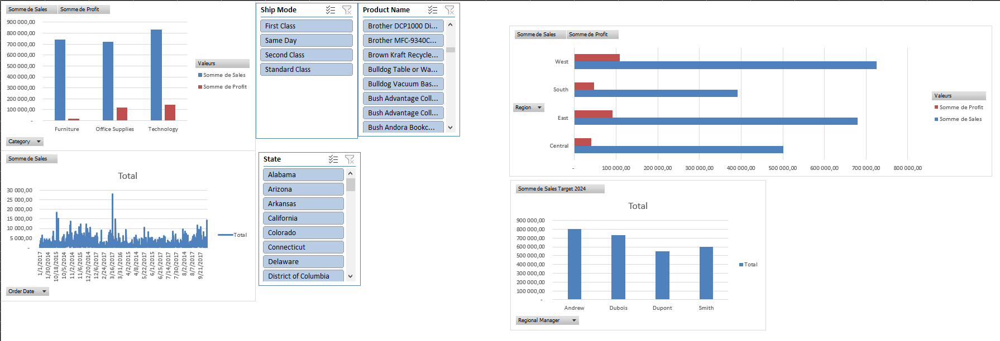

# Superstore Sales Performance Dashboard

## Executive Summary

This project presents a Business Intelligence dashboard designed to drive commercial performance for the "Superstore" retail chain.

The tool was developed to address the challenge of **tracking performance gaps** between regions and sales managers. It transforms a transactional dataset (10,000+ rows) into decision-making indicators, allowing for the identification of underperformance zones and growth opportunities.

**Key Features:**
* **KPI Monitoring:** Dynamic tracking of Revenue, Profit, and Sales Volume.
* **Gap Analysis:** Automatic comparison of Manager performance vs. Annual Targets (Target Achievement).
* **Time Granularity:** Drill-down analysis (Year > Quarter > Month).

## Tech Stack & Methodology

This project demonstrates advanced mastery of the Excel ecosystem for data analysis, simulating a lightweight ETL process.

| Phase | Techniques Used | Details |
| :--- | :--- | :--- |
| **1. Data Cleaning** | `Power Query` / `Data Validation` | Cleaning data types, standardizing dates (ISO), and handling inconsistencies. |
| **2. Modeling** | `Lookup Functions` | Enriching the fact table via joins with the dimension table (Targets/Managers). |
| **3. Analysis** | `Pivot Tables` | Complex aggregation and profitability ratio calculations. |
| **4. UX/UI** | `Slicers` & `Dynamic Charts` | Designing an interactive and intuitive user interface for non-technical stakeholders. |

## Key Insights (Sample Analysis)

Data analysis over the 2014-2017 period highlighted the following:

1.  **Regional Disparities:** The **West** region consistently outperforms, contributing over 30% of global revenue, while the **South** region struggles to meet annual targets (average gap of -15%).
2.  **Category Profitability:** Although the *Furniture* category generates high sales volume, its profitability is critical (<5%), suggesting a need to revise pricing strategy or logistics costs.
3.  **Seasonality:** A marked activity peak is observed in Q4 (Black Friday/Holidays), requiring increased logistical anticipation during this period.

## How to Use this Dashboard

1.  Download the `Superstore_dashboard.xlsx` file
2.  Open the file (Compatible with Excel 2016 and later).
3.  **Important:** If you wish to update the data, go to the `Data` tab, add your new rows, then click `Data > Refresh All` in the Excel ribbon.

## Author

**HELLIER Corentin**

1/12 of the "12 Projects to Become a Data Analyst" from LeCoinStat Challenge.