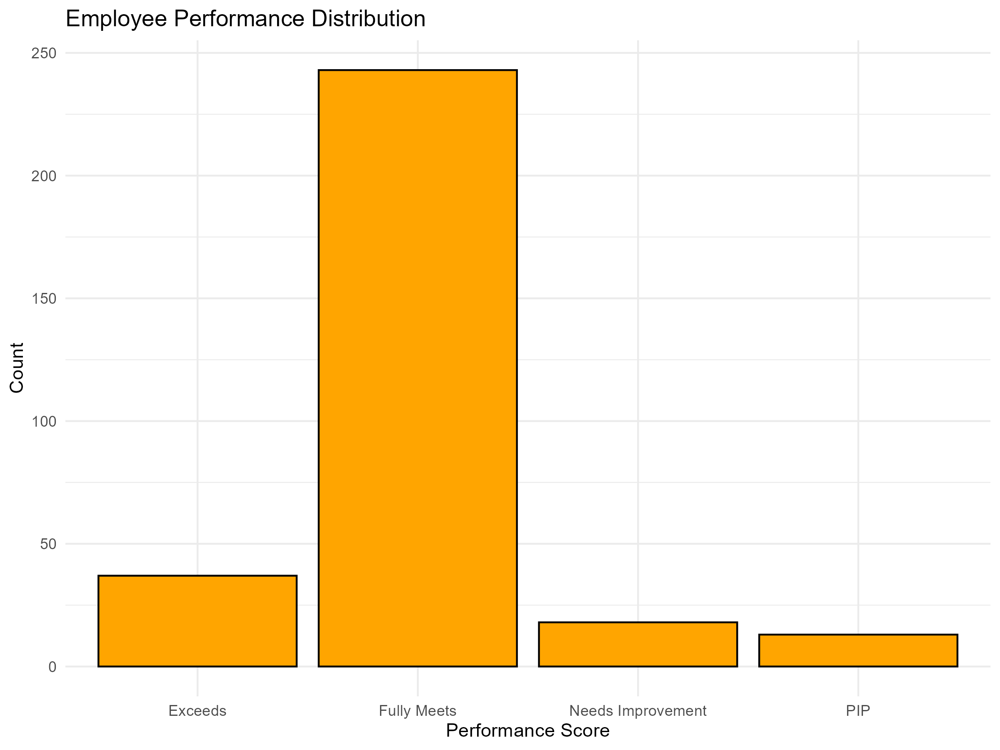
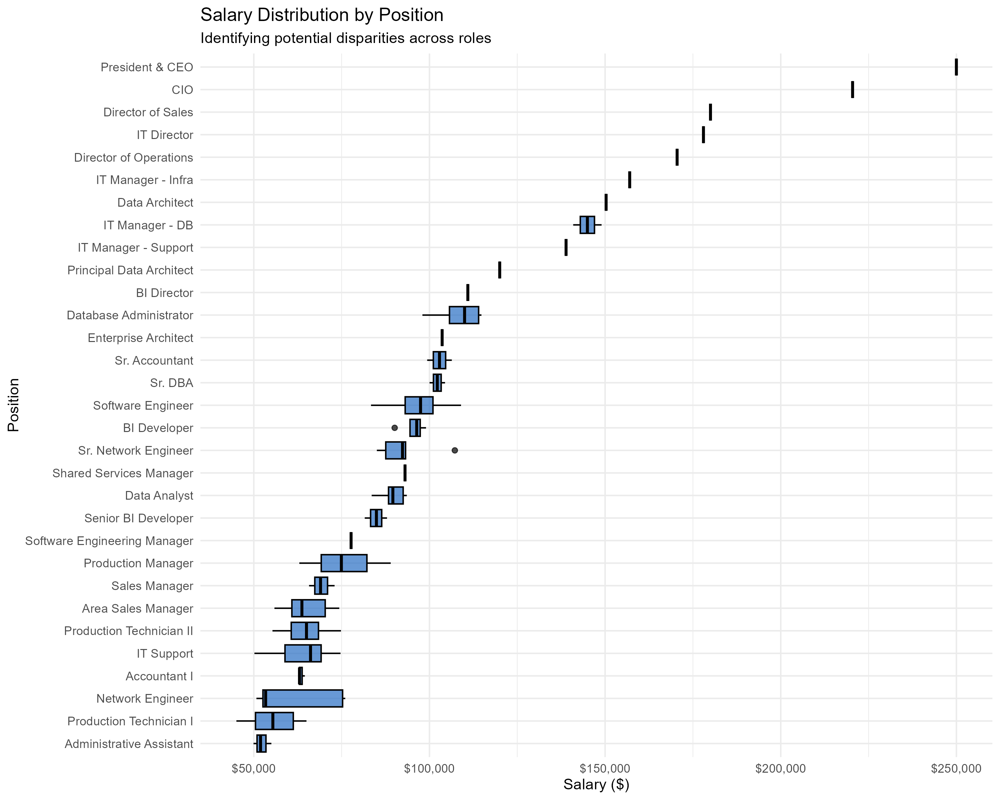

# HR Analytics: Performance & Compensation Analysis


## Project Overview
This project focuses on the **Exploratory Data Analysis (EDA)** of a Human Resources dataset to understand employee performance distribution and salary structures within the company.

**Key Objectives:**
1.  **Data Audit**: Calculate global descriptive statistics (Salary, Satisfaction).
2.  **Performance Analysis**: Visualize the distribution of performance scores to identify evaluation trends.
3.  **Anomaly Detection**: Mathematically identify salary outliers using the Interquartile Range (IQR) method.

---

## Analysis & Insights

### 1. Performance Distribution
The analysis breaks down employees based on their annual performance scores. This visualization helps HR determine if the evaluation distribution is balanced or skewed (e.g., too many "Exceeds" or "Needs Improvement").



### 2. Salary Structure by Position
Using boxplots, we analyzed salary spread across different job positions. This highlights which roles have the highest variability in pay and visualizes the median compensation for each role.



### 3. Outlier Detection (IQR Method)
We applied the `1.5 * IQR` rule to isolate employees whose salaries are statistically considered outliers.
* **Business Value**: This generates a specific list of profiles for HR to audit, ensuring these discrepancies are justified (e.g., specific high-level skills) rather than data entry errors.

---

## Technical Architecture

This project uses a linear R pipeline for data processing and visualization.

| Stage | Package | Key Functionality |
| :--- | :--- | :--- |
| **1. Loading** | `readr` | Fast CSV import and automatic data typing. |
| **2. Cleaning** | `janitor` | Column name normalization (`clean_names`) for cleaner code. |
| **3. Wrangling** | `dplyr` | Data manipulation, selection, and aggregation (`summarise`, `mutate`). |
| **4. Visualization** | `ggplot2` | Advanced graphical representation (Barplots & Boxplots). |

### Code Focus: Statistical Detection
The script explicitly implements the statistical method for transparency:

```r
# Calculating statistical bounds
Q1 <- quantile(df_hr$salary, 0.25, na.rm = TRUE)
Q3 <- quantile(df_hr$salary, 0.75, na.rm = TRUE)
IQR_val <- Q3 - Q1

upper_bound <- Q3 + (1.5 * IQR_val)
lower_bound <- Q1 - (1.5 * IQR_val)

# Filtering Outliers
outliers <- df_hr %>% 
  filter(salary > upper_bound | salary < lower_bound)
```

## How to Run this Project
Prerequisites

You need R and RStudio installed on your machine.
Installation

Open RStudio and install the required libraries:
```r
install.packages(c("tidyverse", "janitor", "scales"))
```

## Execution

    Clone this repository.

    Open the main.R script.

    Ensure HRDataset_v14.csv is in the root directory.

    Run the script.

        Global stats will appear in the console.

        Plots will be saved in the assets/ folder.

        Outliers will be exported to outliers_report.csv.

## Author

**HELLIER Corentin**

2/12 of the "12 Projects to Become a Data Analyst" from LeCoinStat Challenge.