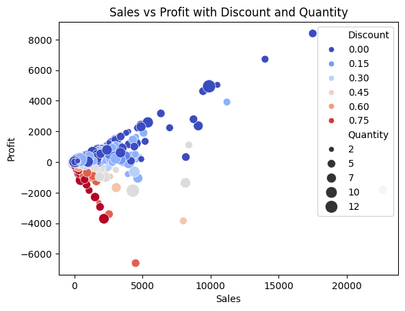
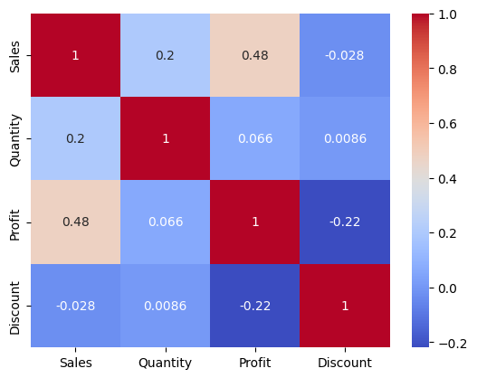

# Sales Strategy Optimization: Correlation Analysis


## Executive Summary
This project aims to identify the mathematical drivers influencing the profitability of the "Superstore" company.

Moving beyond descriptive analytics, this project utilizes **Python** for a statistical approach. The goal is to determine how interactions between Sales Volume, Order Quantity, and specifically **Discount rates**, impact the final Profit margin.



---

## Key Insights & Business Impact

Multivariate analysis highlighted critical correlations impacting the bottom line:

### 1. The "Discount Danger Zone"
Analysis of the correlation matrix (Heatmap) and Scatterplot reveals a strong negative correlation between `Discount` and `Profit`.
* **Insight:** Transactions become systematically unprofitable as soon as discounts exceed a specific threshold (visible in red zones), regardless of the sales volume.
* **Actionable Advice:** Review the discounting policy. High discounts are driving volume but destroying value.

### 2. Volume vs. Profitability
* **Analysis:** The multivariate chart (Sales vs. Profit, sized by Quantity) demonstrates that selling high quantities (`Quantity`) does not guarantee profit if the margin is eroded by discounts.
* **Conclusion:** A "volume-at-all-costs" strategy via aggressive promotions is detrimental to the company's financial health.


*(Pearson Heatmap displaying relationships between Sales, Profit, Quantity, and Discount)*

---

## Technical Architecture

This project operates within a Jupyter Notebook to execute a statistical analysis pipeline.

| Step | Library | Key Functionality |
| :--- | :--- | :--- |
| **1. Ingestion** | `Pandas` | Loading the `Sample - Superstore.csv` dataset with specific encoding handling (latin1). |
| **2. Cleaning & Audit** | `Pandas` | Null value checking and data type validation to ensure integrity. |
| **3. Statistics** | `Pandas .corr()` | Calculating the **Pearson Matrix** to quantify linear relationships. |
| **4. Visualization** | `Seaborn` | **Masked Heatmap** for readability and **4D Scatterplot** (X, Y, Hue, Size) for behavioral analysis. |

### Code Focus: Multivariate Visualization
Leveraging Seaborn to visualize 4 dimensions on a single chart:
```python
sns.scatterplot(
    data=df, 
    x="Sales", 
    y="Profit", 
    hue="Discount",
    size="Quantity",
    palette="viridis_r" 
)
```

## How to run the project :

```bash
pip install pandas seaborn matplotlib
```

Setup: Place the Sample - Superstore.csv file in the same directory as the script.

Execution: Launch the Jupyter Notebook or run the Python script.

```bash
jupyter notebook main.ipynb
```

## Author

**HELLIER Corentin**

3/12 of the "12 Projects to Become a Data Analyst" from LeCoinStat Challenge.
