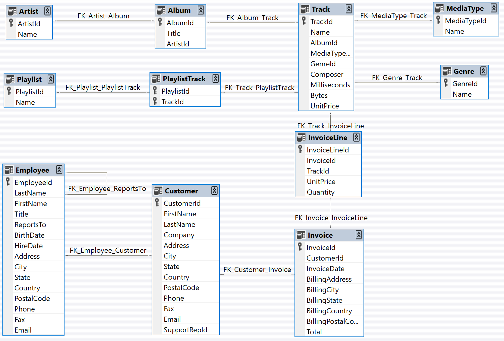

# SQL Sales Reporting & Analysis: Chinook Music Store


## Project Overview
This project focuses on mastering basic **SQL** to query and analyze a relational database (Chinook - a digital music store). 

The goal was to replace manual data extraction with structured SQL queries to answer specific business questions regarding revenue tracking, sales agent performance, and product catalogue analysis.

### Note on Dataset & Dates
> **Dataset Versioning:** This analysis uses an updated version of the Chinook database. Consequently, the temporal analysis (Sales by Year) reflects the most recent data available in this version (**2021-2025**) rather than the legacy static dataset dates (2009-2013), i did my queries with the new dates to test it then i changed the values to stick with what the project asked


*(Chinook Database Schema)*

## Key Findings & Analysis

The SQL queries in this repository address the following business areas:

### 1. Sales & Customer Analysis
* **Global Market Penetration:** Identified top-performing countries by total revenue to guide marketing focus.
* **Sales Team Performance:** Ranked "Sales Support Agents" based on generated revenue and client portfolio size to evaluate employee efficiency.

### 2. Product Catalogue Insights
* **Bestsellers:** Extracted the Top 5 best-selling tracks and Top 3 artists to inform inventory and promotion strategies.
* **Format Preferences:** Analyzed sales distribution by Media Type (e.g., MPEG audio vs. Protected AAC) to understand consumption habits.

## Technical Skills Demonstrated

This project covers fundamental to intermediate SQL concepts:

| Concept | Application in Project |
| :--- | :--- |
| **Selection & Filtering** | `SELECT`, `WHERE` to target specific markets (e.g., Brazil) or timeframes. |
| **Joins** | `INNER JOIN`, `LEFT JOIN` to combine data across Customer, Invoice, and Employee tables. |
| **Aggregation** | `SUM`, `COUNT`, `GROUP BY` to calculate KPIs like Total Revenue per Agent. |
| **Ranking** | `ORDER BY`, `LIMIT` to identify top-performing products and sales agents. |
| **Date Functions** | `strftime` to extract years for temporal sales analysis (Seasonality). |

### Sample Query: Top Sales Agent (2022)
```sql
SELECT 
    e.FirstName, 
    e.LastName, 
    SUM(i.Total) AS TotalSales
FROM Employee e
JOIN Customer c ON c.SupportRepId = e.EmployeeId
JOIN Invoice i ON i.CustomerId = c.CustomerId
WHERE strftime('%Y', i.InvoiceDate) = '2022'
GROUP BY e.EmployeeId
ORDER BY TotalSales DESC
LIMIT 1;
```

## How to Run

    Prerequisites: An SQLite compatible tool (DB Browser for SQLite, DBeaver) or a Python environment.

    Setup: Download the Chinook_Sqlite.sqlite database file.

    Execution: Open sql_queries.sql and execute the queries against the database to view real-time results.

## Author

**HELLIER Corentin**

5/12 of the "12 Projects to Become a Data Analyst" from LeCoinStat Challenge.
