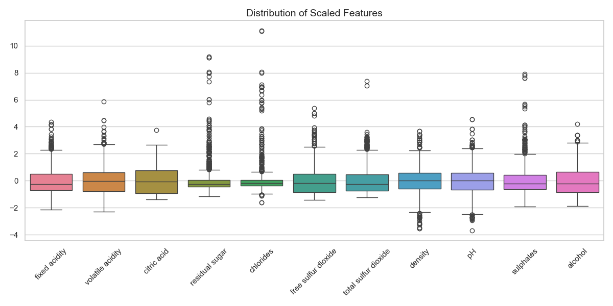
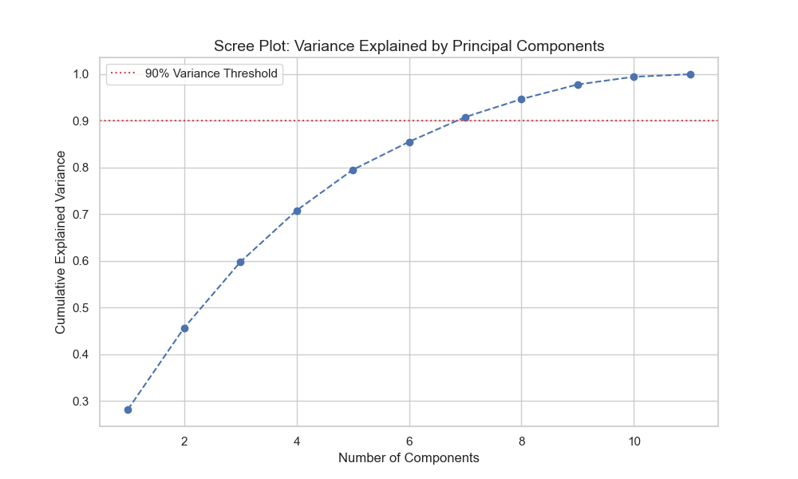
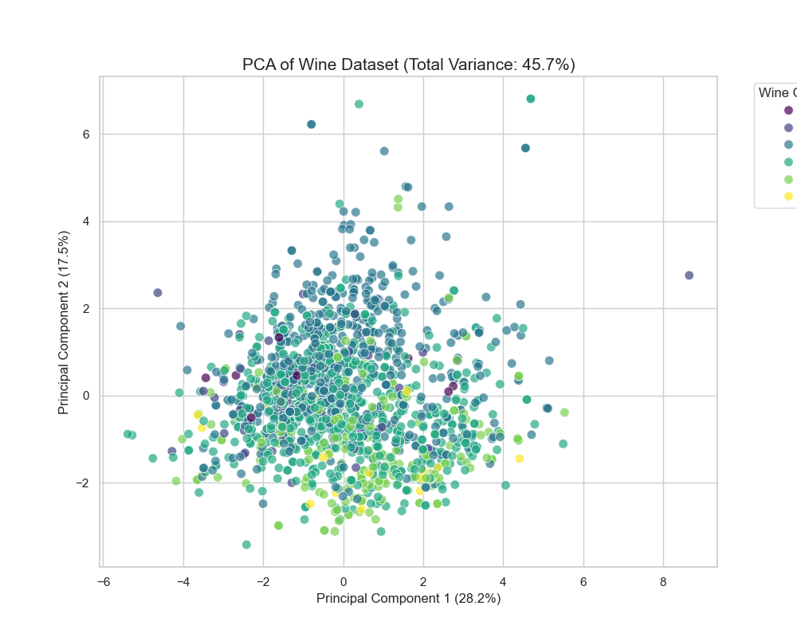
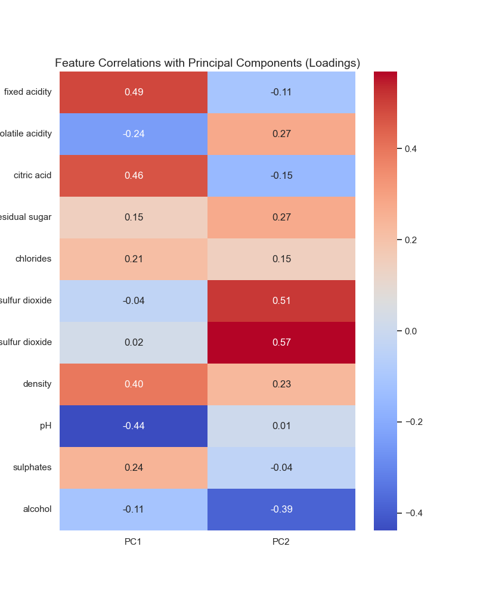

# Wine Quality Profiling: Dimensionality Reduction (PCA)


## Executive Summary
**Project Type:** Unsupervised Machine Learning (PCA)  

This project explores the physicochemical complexity of red wines using **Principal Component Analysis (PCA)**. The objective is to reduce the dimensionality of the dataset (11 chemical features) to identify key patterns and determine if wine quality correlates with specific chemical profiles.

By projecting the data into a lower-dimensional space (2D), we aim to visualize clusters and interpret the "chemical signature" of high-quality wines.

---

## Methodology & Key Insights

To ensure statistical validity, the analysis follows a strict pipeline: **Standardization → Variance Analysis → Projection → Interpretation**.

### 1. Data Standardization (Preprocessing)
Since chemical properties have vastly different scales (e.g., *Sulfur Dioxide* > 100 mg/L vs. *Chlorides* < 0.1 g/L), raw data would bias the PCA. I applied **Z-score normalization** (`StandardScaler`) to ensure each feature contributes equally to the variance.


*Figure 1: Distribution of features after standardization (Mean=0, Std=1).*

### 2. Dimensionality Reduction Decision (Scree Plot)
How many dimensions are needed to represent the data?
The **Scree Plot** below analyzes the cumulative explained variance.


*Figure 2: Cumulative variance explained by the number of components.*

> **Insight:** The first 2 Principal Components (PC1 & PC2) capture a significant portion of the variance, justifying a 2D projection for visualization purposes, though retaining more components would be necessary for a predictive model (>90% variance).

### 3. PCA Projection (2D Visualization)
Projecting the 1599 wines onto the new 2D plane defined by PC1 and PC2. The color gradient represents the **Quality Score** (3 to 8).


*Figure 3: Wines projected onto the two main principal components.*

> **Observation:** There is no distinct separation of clusters solely based on quality, suggesting that wine quality is a complex, non-linear function of these chemical properties. However, we observe a slight gradient trend.

### 4. Feature Interpretation (Loadings)
What do the axes actually mean? This heatmap shows the correlation between the original variables and the new Principal Components.


*Figure 4: Loadings - How much each feature influences PC1 and PC2.*

---

## Technical Architecture

| Step | Technology | Description |
| :--- | :--- | :--- |
| **Ingestion** | `Pandas` | Loading `winequality-red.csv` (semicolon separator). |
| **Preprocessing** | `Scikit-Learn` | `StandardScaler` for centering and scaling. |
| **Modeling** | `Scikit-Learn` | `PCA` decomposition to compute eigenvectors. |
| **Visualization** | `Seaborn` | Generating publication-quality plots (Scatter, Heatmap, Boxplot). |

### Code Snippet: PCA Pipeline
```python
# 1. Standardization (Mandatory for PCA)
scaler = StandardScaler()
features_scaled = scaler.fit_transform(features)

# 2. PCA Transformation
pca = PCA(n_components=2)
principal_components = pca.fit_transform(features_scaled)

# 3. Variance Extraction
print(f"Explained Variance Ratio: {pca.explained_variance_ratio_}")
```

## How to Run this Project

Clone this project

```bash
cd wine-quality-pca
```

```bash
pip install pandas matplotlib seaborn scikit-learn
```

```python
python main.py
```

## Author

**HELLIER Corentin**

6/12 of the "12 Projects to Become a Data Analyst" from LeCoinStat Challenge.
