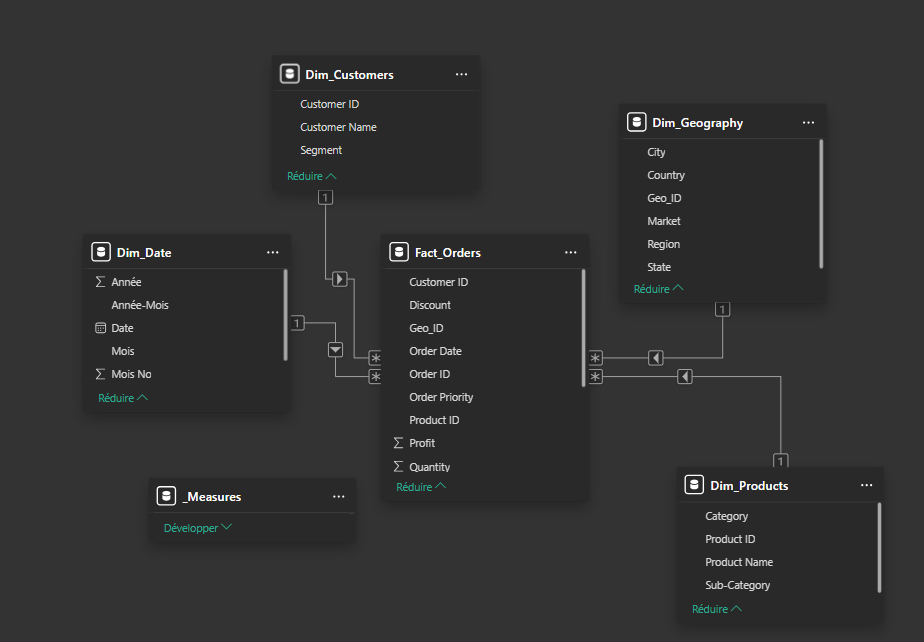

# Global Superstore: Sales Performance Dashboard


## Executive Summary

This project transforms raw retail transaction data into an interactive **Business Intelligence solution**. The goal is to enable stakeholders to monitor global sales performance, identify high-value products, and optimize shipping costs across different markets.

Unlike static reports, this dashboard leverages **Time Intelligence** and a **Star Schema data model** to allow dynamic drill-down analysis from a global view to specific product transactions.

---

## Business Problem & Insights

**Context:** The Global Superstore is a retail giant operating in over 140 countries. The management team needed a consolidated view to answer three key questions:
1. Which markets are driving profitability vs. volume?
2. How are shipping costs impacting the bottom line?
3. Which product categories require strategic adjustments?

**Key Findings:**
* **Technology is the Profit Driver:** While "Office Supplies" generates the highest volume of orders, the "Technology" category accounts for **40% of total profit**, highlighting a need to shift marketing focus toward high-ticket tech items.
* **Shipping Inefficiencies:** Same-Day shipping in the APAC region has a disproportionately high cost compared to sales generated.
* **Seasonality:** Sales consistently spike in Q4 (Nov-Dec), necessitating better inventory planning for year-end logistics.

---

## Technical Architecture

To ensure performance and scalability, the original flat file dataset was transformed into a robust **Star Schema**.

### 1. Data Modeling (Star Schema)
Instead of using a single inefficient flat table, the data was normalized into Fact and Dimension tables:

* **Fact_Orders:** Contains quantitative metrics (`Sales`, `Quantity`, `Profit`, `Shipping Cost`) and Foreign Keys.
* **Dim_Customers:** Customer names, IDs, and Segments.
* **Dim_Geography:** Hierarchical location data (City > State > Country > Region > Market).
* **Dim_Products:** Product details, Categories, and Sub-Categories.
* **Dim_Date:** A dedicated calendar table for Time Intelligence functions (YoY, QTD).


*(Screenshot of the Model View in Power BI)*

### 2. ETL Process (Power Query)
* **Data Cleaning:** Handling null values in `Postal Code` and removing irrelevant columns like `Row ID`.
* **Typing:** Ensuring strict data typing for `Order Date` and currency fields.
* **Parameters:** Dynamic path management for data sources.

### 3. Advanced DAX Measures
No implicit measures were used. All calculations are explicit DAX measures organized in a dedicated table.

**Example: Year-over-Year Growth**
```dax
Sales YoY % = 
VAR CurrentSales = [Total Sales]
VAR PreviousSales = CALCULATE([Total Sales], SAMEPERIODLASTYEAR('Dim_Date'[Date]))
RETURN
    DIVIDE(CurrentSales - PreviousSales, PreviousSales, 0)
```

**Example! Profit Margin**
```dax
Profit Margin % = DIVIDE([Total Profit], [Total Sales], 0)
```

## Dashboard Features

The report allows users to:

    Filter dynamically by Year, Region, and Category.

    Drill-through from a specific country to see underlying product details.

    Analyze trends using line charts comparing current year vs. previous year performance.

    View KPIs instantly via cards showing Total Sales, Profit, and Quantity.

## How to Run this Project

### Prerequisites:

    Microsoft Power BI Desktop

### Installation:

    Clone this repository.

    Open Dashboard_BI.pbix in Power BI Desktop.

    If necessary, go to Transform Data > Data Source Settings to repoint the source to the local Global_Superstore2.csv file included in the data folder.

    Click Refresh to load the data.

## Author

**HELLIER Corentin**

7/12 of the "12 Projects to Become a Data Analyst" from LeCoinStat Challenge.