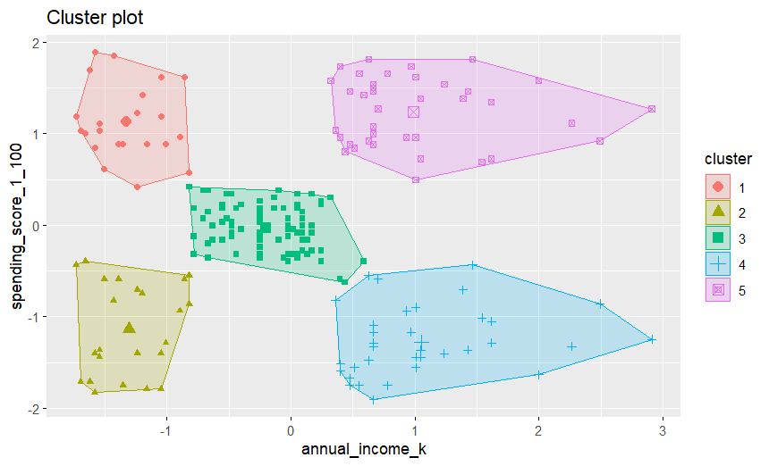
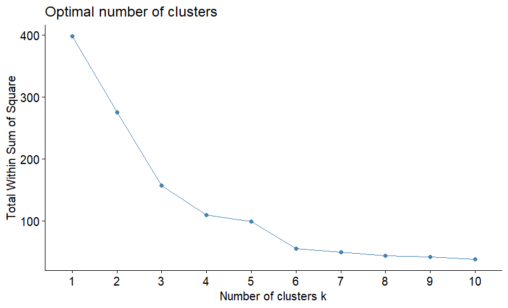

# Customer Segmentation: K-Means Clustering


## Executive Summary
This project (Project 9 of my Data Analyst Portfolio) focuses on **Unsupervised Machine Learning**. The goal is to assist the marketing team in optimizing their strategy by identifying distinct customer personas within the database.

Using the **K-Means algorithm** on income and spending data, we successfully segmented the customer base into **5 strategic groups**, enabling tailored marketing campaigns and improved ROI.


*(Visualization of the 5 customer clusters based on Income and Spending Score)*

---

## Analysis & Customer Profiles

The statistical approach identified **5 key segments**. Below is the interpretation of the clusters (based on average income and spending scores):

| Segment | Characteristics (Income / Spending) | Business Recommendation |
| :--- | :--- | :--- |
| **The "Whales" (Target)** | *High Income, High Spending* | **Priority.** Most profitable customers. Target with VIP programs and exclusive offers. |
| **The "Savers"** | *High Income, Low Spending* | High purchasing power but low engagement. Use brand awareness campaigns to convert them. |
| **The "Standard"** | *Medium Income, Medium Spending* | The average customer. Focus on retention and loyalty programs. |
| **The "Impulsive"** | *Low Income, High Spending* | Likely younger demographic. High engagement but budget constraints. Offer discounts/payment plans. |
| **The "Cautious"** | *Low Income, Low Spending* | Low value currently. Don't overspend on acquisition for this segment. |

---

## Technical Architecture

The project follows a standard Data Analysis pipeline in R:

### 1. Data Preprocessing & Scaling
Since K-Means relies on Euclidean distance, it is sensitive to the magnitude of data.
* **Technique:** Z-Score Normalization via `scale()`.
* **Result:** "Annual Income" and "Spending Score" contribute equally to the cluster definition.

### 2. Finding the Optimal K (Elbow Method)
We used the Within-Cluster Sum of Square (WSS) method to find the optimal number of clusters.
```r
fviz_nbclust(df_cluster, kmeans, method = "wss")
# The plot indicates a clear "elbow" at k=5
```



## How to Run

```r
install.packages(c("tidyverse", "janitor", "factoextra"))
```

## Execution:

    Clone this repository.

    Place Mall_Customers.csv in your working directory.

    Run main.R.

**Output**: The script will generate the Elbow plot, the Cluster visualization, and print the summary table of customer profiles in the console.

## Author

**HELLIER Corentin**

9/12 of the "12 Projects to Become a Data Analyst" from LeCoinStat Challenge.