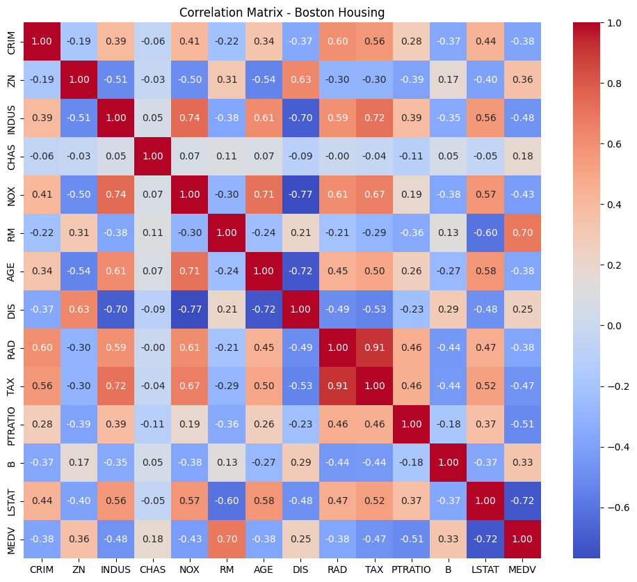
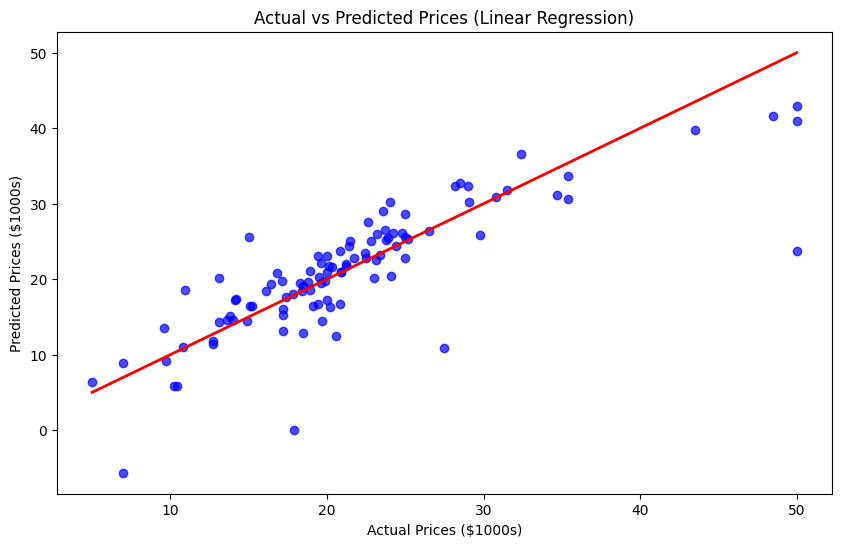
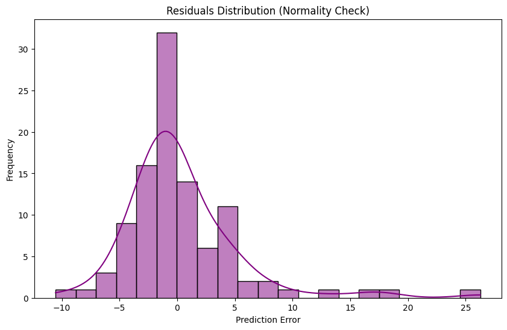

# Boston Housing Price Prediction


## Project Overview
This project applies **Supervised Machine Learning** to solve a regression problem. The goal is to predict the median value of owner-occupied homes (`MEDV`) in Boston suburbs based on 13 socio-economic and structural attributes.

This analysis focuses on data cleaning, statistical preprocessing (Standardization), and interpreting feature importance using Linear Regression.

---

## Key Findings & Analysis

By standardizing the data (Scaling), we were able to compare the coefficients correctly to determine which factors genuinely impact housing prices.

### Top Influential Factors:
1.  **LSTAT (Lower Status Population):** Strong **negative** impact. As the percentage of lower-status population increases, housing prices drop significantly.
2.  **RM (Average Number of Rooms):** Strong **positive** impact. Larger houses with more rooms command higher prices.
3.  **DIS (Weighted Distance to Employment Centers):** Significant negative correlation in this multivariate context.

*(Note: Without standardization, variables with large scales like 'TAX' would falsely appear less significant due to smaller coefficient values.)*

---

## Technical Workflow

The project follows a standard Data Science pipeline:

| Step | Tool / Method | Description |
| :--- | :--- | :--- |
| **1. Data Cleaning** | `Pandas` | Detected missing values (`NaN`) and handled them using **Median Imputation** to avoid data loss. |
| **2. EDA** | `Seaborn` | Correlation Heatmap to visualize relationships between features. |
| **3. Preprocessing** | `StandardScaler` | **Crucial:** Standardized features ($\mu=0, \sigma=1$) to ensure the Linear Regression model treats all variables equally. |
| **4. Modeling** | `LinearRegression` | Trained the model on 80% of the data. |
| **5. Evaluation** | `RMSE` & `R²` | Evaluated performance on the test set (20%). |

### Data Correlation

*Correlation heatmap showing relationships between features.*

### Prediction Accuracy

*Comparison between the model predictions and actual values. Points on the red line indicate perfect predictions.*

### Error Analysis

*Distribution of residuals (errors). A normal distribution (bell curve) indicates a healthy regression model.*
---

## Code Structure

### Model Training Snippet
```python
from sklearn.preprocessing import StandardScaler
from sklearn.linear_model import LinearRegression

# Standardizing the data is mandatory for meaningful coefficient analysis
scaler = StandardScaler()
X_train_scaled = scaler.fit_transform(X_train)
X_test_scaled = scaler.transform(X_test)

# Training
model = LinearRegression()
model.fit(X_train_scaled, y_train)
```

## How to Run

Clone this project

```bash
pip install -r requirements.txt
```

```python
python main.py
```

## Author

**HELLIER Corentin**

10/12 of the "12 Projects to Become a Data Analyst" from LeCoinStat Challenge.
