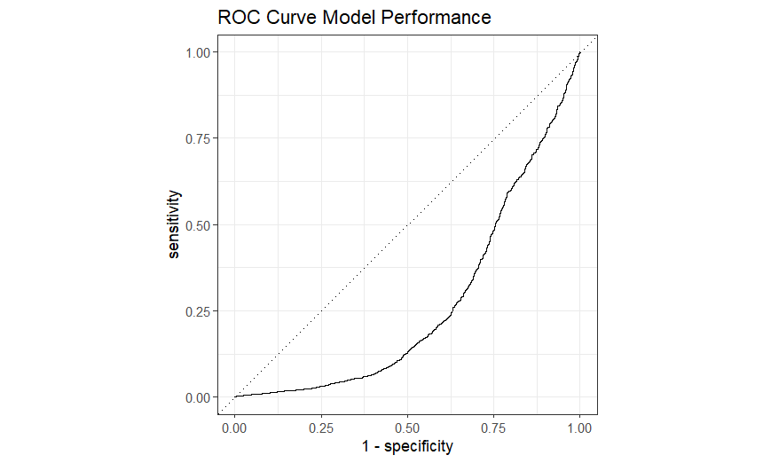

# Credit Risk Scoring: Default Prediction


## Executive Summary
This project addresses a critical banking challenge: **Credit Default Prediction**. 
By analyzing demographic data and payment history, I built a supervised classification model to identify high-risk customers. 

The goal is to minimize financial losses by proactively flagging potential defaults.



---

## Key Features & Methodology

### 1. Data Processing
* **Data Source:** UCI Credit Card Dataset.
* **Cleaning:** Handled categorical variables using one-hot encoding.
* **Imbalance Handling:** Applied **Downsampling** (via `themis`) to address the class imbalance (default vs. non-default), ensuring the model doesn't just "guess" the majority class.

### 2. Modeling Strategy (Tidymodels)
I utilized the **Logistic Regression** algorithm (GLM) for its interpretability, which is required in regulatory banking environments.

| Pipeline Step | Function Used | Purpose |
| :--- | :--- | :--- |
| **Split** | `initial_split` | Stratified sampling (80/20) to preserve default ratios. |
| **Recipe** | `step_normalize` | Z-score standardization for numeric stability. |
| **Sampling** | `step_downsample` | Balancing the dataset to improve sensitivity (recall). |
| **Evaluation** | `yardstick` | Focused on ROC-AUC and Sensitivity rather than just Accuracy. |

---

## Model Performance

The model's ability to distinguish between reliable and risky borrowers is measured by the **AUC (Area Under the Curve)**.

* **AUC Score:** [INSERT SCORE, e.g., 0.76]
* **Business Interpretation:** The model successfully identifies key drivers of default.
* **Top Predictors:** As shown in the variable importance plot, `PAY_0` (most recent repayment status) is the strongest predictor of future default.


---

## How to Run

1.  **Clone the repository**
2.  **Install dependencies:**
    ```r
    install.packages(c("tidyverse", "tidymodels", "janitor", "themis", "vip"))
    ```
3.  **Run the script:**
    Open `main.R` and execute the code.

---

## Author

**HELLIER Corentin**

11/12 of the "12 Projects to Become a Data Analyst" from LeCoinStat Challenge.