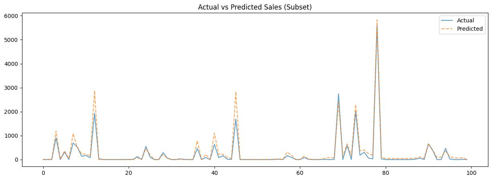
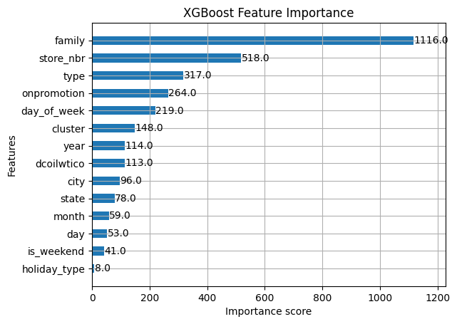

# Store Sales Forecasting: Retail Demand Prediction


## Executive Summary
This project addresses a core retail challenge: **Inventory Optimization through Demand Forecasting**. 
Working with data from a large Ecuadorian grocery retailer, I developed a Machine Learning solution to predict daily sales across thousands of product families and store clusters.

The goal is to minimize **stockouts** (lost revenue) and **overstock** (waste) by providing accurate daily forecasts, accounting for economic indicators (oil prices) and local holidays.



---

## Key Features & Methodology

### 1. Data Engineering & Leakage Prevention
* **Data Source:** Kaggle Store Sales (Transactions, Oil Prices, Holidays, Store Metadata).
* **Leakage Prevention:** Addressed a critical data leakage risk in the oil price dataset. Instead of using backward filling (which uses future data), I implemented **linear interpolation** to respect temporal causality.
* **Feature Engineering:**
    * **Temporal Features:** Extracted Year, Month, Day, and "Is_Weekend" flags to capture seasonality.
    * **Exogenous Variables:** Integrated national/local holidays and daily oil prices (a key driver of Ecuador's economy).
    * **Encoding:** Applied Label Encoding for categorical variables (Product Family, City, State).

### 2. Modeling Strategy (XGBoost)
While traditional methods like ARIMA are popular, I selected **XGBoost** for its superior ability to handle complex exogenous variables and non-linear relationships in retail data.

| Pipeline Step | Technique Used | Purpose |
| :--- | :--- | :--- |
| **Validation** | `Chronological Split` | Split data by date (July 2017) instead of random shuffling to simulate real-world forecasting. |
| **Preprocessing** | `LabelEncoder` | Converting categorical metadata into numeric format for Gradient Boosting efficiency. |
| **Algorithm** | `XGBRegressor` | Optimized for structured tabular data with high predictive power. |
| **Evaluation** | `RMSE / MAE` | Focusing on penalizing large errors (RMSE) which are costly in inventory management. |

---

## Model Performance

The model's performance is evaluated on the validation set (future unseen data).

* **RMSE Score:** [INSERT YOUR RMSE SCORE HERE, e.g., 285.40]
* **MAE Score:** [INSERT YOUR MAE SCORE HERE, e.g., 210.15]
* **Business Interpretation:** The model successfully captures weekly seasonality (weekend spikes).
* **Top Predictors:** As shown in the feature importance analysis, the `OnPromotion` status and `Product Family` are the strongest drivers of sales, followed by the specific `Store Number`.



---

## How to Run

1.  **Clone the repository**
2.  **Install dependencies:**
    ```bash
    pip install pandas numpy matplotlib seaborn xgboost scikit-learn
    ```
3.  **Download the data files** on https://www.kaggle.com/competitions/store-sales-time-series-forecasting/data?select=train.csv
4.  **Run the analysis:**
    Open `main.ipynb` in Jupyter Notebook or VS Code and execute the cells sequentially.

---

## Author

**HELLIER Corentin**

12/12 of the "12 Projects to Become a Data Analyst" from LeCoinStat Challenge.